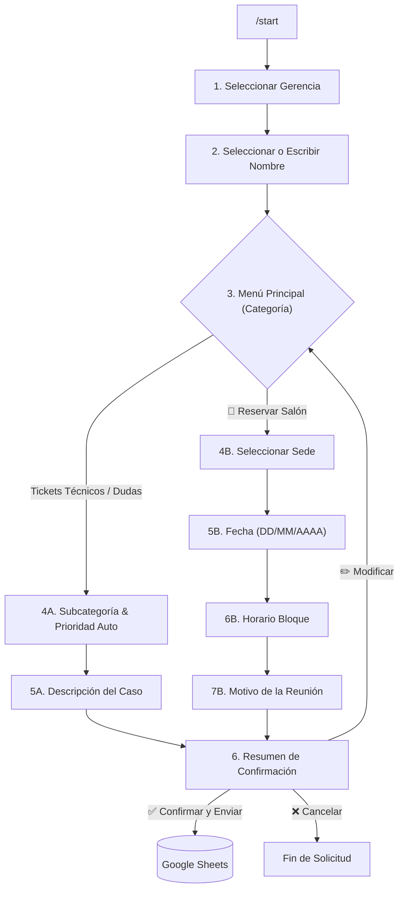

# 🖥️ BOT ITC — Esquema Presentación de Funcionalidades

## 📌 Visión General del Sistema
**BOT ITC** es el Asistente Virtual Nivel 1 de Soporte e Informática para Telegram. Su función principal es **canalizar, registrar y priorizar incidencias técnicas** de la empresa y **gestionar las reservas del salón de videoconferencia**, centralizando todos los datos en **Google Sheets** en tiempo real.

---

## 🛠️ 1. Comandos Principales de Telegram (Menú `[/]`)

En la esquina inferior del chat de Telegram (botón `[/]`), el usuario dispone de los siguientes comandos predeterminados:

| Comando | Descripción | Uso Principal |
|---|---|---|
| `/start` | 🚀 **Iniciar Registro** | Inicia el asistente interactivo para crear un ticket de soporte o reservar un salón. |
| `/estado` | 📊 **Consultar Solicitudes** | Muestra la lista de los últimos 5 tickets y reservas del usuario con su estado actual (🔴, 🟡, 🟢). |
| `/cancel` | ❌ **Cancelar Operación** | Cancela la solicitud en curso en cualquier momento y limpia el teclado. |

---

## 🗺️ 2. Flujo de Navegación del Asistente

El bot utiliza un **flujo guiado por botones interactivos** que impide errores de escritura hasta llegar a la descripción:

> [!TIP]
> **Botón `⬅️ Volver` disponible:** En cada paso del flujo, el usuario dispone del botón `⬅️ Volver` para regresar al paso inmediatamente anterior sin necesidad de reiniciar con `/start`.

---

## 📂 3. Apartados y Categorías de Soporte

### 🅰️ Tickets Técnicos y Consultas

| Categoría Principal | Subcategorías Incluidas | Prioridad Auto |
|---|---|---|
| **💻 Hardware y Equipos** | PC/Laptop No Enciende, Pantalla Dañada, Cargador Dañado | 🔴 Alta |
| | Teclado/Mouse, Impresora No Imprime, Cables Dañados, Otro Hardware | 🟡 Media |
| | Instalar Impresora, Solicitud Equipo Nuevo, Cambio Periférico | 🟢 Baja |
| **🖥️ Software y Aplicaciones** | Antivirus / Alerta de Seguridad | 🔴 Alta |
| | Office No Funciona / Vencido, Correo Electrónico, Otro Software | 🟡 Media |
| | Instalar Programa, Actualizar Software, Máquina Lenta | 🟢 Baja |
| **🌐 Redes y Conectividad** | Sin Internet, VPN No Funciona | 🔴 Alta |
| | Conexión Lenta, WiFi No Conecta, Carpeta Compartida, Otro Problema | 🟡 Media |
| **📊 Dudas SITC / PCP** | Requisiciones, Compras, Tickets de Pago, Administración, PCP | 🟡 Media |
| | Otra Duda de Sistemas | 🟢 Baja |
| **❓ Otros / Consultas** | Consulta General, Solicitud Especial | 🟢 Baja |

---

### 🅱️ Reserva de Salón de Videoconferencia

- **Sedes Disponibles:** `[ Campo Boscán ]` `[ Maracaibo ]`
- **Validación de Fecha:** Formato estricto `DD/MM/AAAA` con Expresión Regular.
- **Bloques Horarios:** `08:00 - 10:00`, `10:00 - 12:00`, `14:00 - 16:00`, `16:00 - 18:00`, `Todo el día`.
- **Estado Inicial:** Registrado como *Pendiente por Confirmación*.

---

## 📊 4. Estructura del Libro Google Sheets

El bot mantiene automáticamente 4 pestañas formateadas en el libro de Google Sheets:

### 1. `Dashboard` (Panel de Control Resumen)
- Conteo automático mediante fórmulas `=COUNTIF()` de:
  - Tickets por Estado (*Abierto*, *En Proceso*, *Cerrado*).
  - Tickets por Nivel de Prioridad (*Alta*, *Media*, *Baja*).
  - Tickets por Categoría Técnica.
  - Reservas por Estado (*Pendiente*, *Confirmada*, *Rechazada*).

### 2. `Tickets_Soporte` (Base de Datos de Tickets)
- Columnas: `N° Ticket (ITC-0001)`, `Fecha/Hora`, `Nombre`, `Telegram ID`, `Gerencia`, `Categoría`, `Subcategoría`, `Descripción`, `Prioridad`, `Estado`.

### 3. `Reservas_Salon` (Base de Datos de Reservas)
- Columnas: `N° Reserva (RES-0001)`, `Fecha/Hora Registro`, `Nombre`, `Telegram ID`, `Gerencia`, `Sede`, `Fecha Reserva`, `Horario`, `Motivo`, `Estado`.

### 4. `Configuración Menús` (Dinámica)
- Permite actualizar los menús del bot en caliente desde la hoja sin tocar código Python.
- Columnas `E` y `F` permiten mapear usuarios por departamento para que aparezcan como botones.

---

## 🔒 5. Funcionalidades de Seguridad y Resiliencia

1. **Timeout por Inactividad (30 min):** Cierra sesiones abandonadas automáticamente para liberar recursos.
2. **Respaldo Local JSON (Offline Mode):** Si la conexión a Google Sheets falla o el internet se cae, los tickets se guardan localmente y se sincronizan en segundo plano en cuanto vuelve la conexión.
3. **Despliegue Cloud Ready:** Listo para ejecutarse 24/7 en **Docker**, **Railway**, **Render** u **Oracle Cloud Free Tier**.
